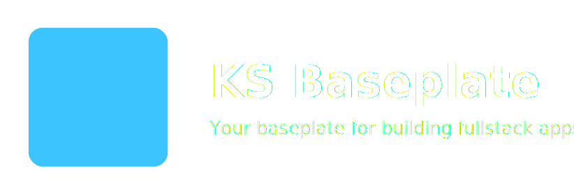

<p align="center">
  
</p>


# 🧱 KS Baseplate

A modern starter template that gives you a solid **baseplate** to build your next fullstack project.  
Everything is already wired together, tested, linted, and production-ready — you just start snapping on your features.

`React 19 + Vite + TypeScript + MUI`  
`Node + Express 5 + Apollo Server + MongoDB`  
All running inside **Yarn v4 Workspaces**, fully typed, fully tested.

# 🚀 Features

### **Frontend**
- ⚡️ Vite (ultra-fast dev server)
- ⚛️ React 19 + TypeScript
- 🎨 MUI (theme system + Roboto fonts)
- 🔗 React Router
- 🔮 Apollo Client
- 🧪 Vitest + Testing Library
- 🔧 Clean import aliases (`components/*`, `pages/*`, `theme/*`, `src/*`)
- 🧩 Working Todo example using real GraphQL

### **Backend**
- 🟢 Node.js + Express 5
- 🧬 Apollo Server (GraphQL)
- 🗃️ MongoDB integration
- 🧩 Modular GraphQL design (feature-based modules)
- 🧪 Vitest resolver tests (mocked db/context)
- 🛠 Built with tsup for reliable production builds

### **Tooling**
- 🧶 Yarn v4 workspaces
- 📏 ESLint 9 (flat config)
- ✨ Prettier formatting
- 🌈 Colored logs for dev mode
- 🏗 Production mode with Express serving the built client


# 📚 Branch System
KS Baseplate uses a **feature-branch system** to keep the main template clean while offering optional integrations you can explore or merge into your own project.

Every feature branch is self-contained and built on top of the `main` template.
### Main Branches
| **Branch** | **Description** |
|------------|-----------------|
| **main**   | The core KS Baseplate template — clean, minimal, and production-ready. No authentication or optional integrations included. |

### Feature Branches
|  **Branch  |  **Status**  |  **Description**  |
|------------|--------------|-------------------|
|**feature/auth0**|**snapped-on**|Adds full authentication/authorization using Auth0 (React SDK + JWT-protected GraphQL API).|
|*(future branches)*|*organizing bricks*| Additional integrations (Prisma, Stripe, file uploads, RBAC, etc.) may be added over time.|

<br />

### 🔧 How to use feature branches
#### Checkout a feature directly:
```bash
git checkout feature/auth0
```
#### Create a new project directly from a feature branch:
```bash
npx degit kamoteshake/KS-Baseplate#feature/auth0 my-app
```
#### Merge a feature branch into your project:
```bash
git merge origin/feature/auth0
```
This system keeps `main` simple and extensible while allowing developers to use pre-built feature integrations as needed.


# 🏁 Quick Start

## 1. **Create a new project from KS Baseplate (no git history)**

Use **degit** to copy the template without cloning or keeping Git history:

```bash
npx degit https://github.com/kamoteshake/KS-Baseplate#main my-new-app
```
This will:
- Copy the KS Baseplate template
- Remove all Git History
- Create a new folder called `my-new-app`

Then move into it:
```bash
cd my-new-app
```

## 2. **Install all dependencies**
```bash
yarn
```

## 3. **Run the fullstack dev environment**
```bash
yarn dev
```
This starts:
- 🟩 Client → http://localhost:5173
- 🟦 Server → http://localhost:4000

Both with live reload.

## 4. **(Optional) Initialize your own Git repo**
```bash
git init
git add .
git commit -m "Initial commit"
```

## 5. **Other useful commands**
```bash
yarn test      # Run tests (client + server)
yarn lint      # Lint everything
yarn format    # Format with Prettier
yarn build     # Build client + server for production
yarn start     # Start production server
```


# 🌳 Project Structure
```lua
.
├── client/                 # React + Vite app
│   ├── src/
│   │   ├── components/
│   │   │   └── TodoSection/
│   │   ├── pages/
│   │   │   └── Home/
│   │   ├── theme/
│   │   ├── apolloClient.ts
│   │   ├── router.tsx
│   │   └── main.tsx
│   └── vite.config.ts
│
├── server/                 # Node + Express + GraphQL
│   ├── src/
│   │   ├── config.ts
│   │   ├── db.ts
│   │   ├── graphql/
│   │   │   ├── context.ts
│   │   │   ├── schema.ts
│   │   │   ├── resolvers.ts
│   │   │   └── modules/
│   │   │       ├── hello/
│   │   │       ├── health/
│   │   │       └── todos/
│   │   └── index.ts
│   └── tsup.config.ts
│
├── eslint.config.cjs
├── .prettierrc
├── package.json
└── yarn.lock
```
A clear foundation built for easy expansion.


# 🔐 Environment Variables
This template uses **workspace-specific** `.env` **files**.

### Server(`server/.env`)
```env
PORT=4000
MONGO_URI=mongodb://localhost:27017/ks_baseplate
```

### Client(`client/.env`)
```env
VITE_GRAPHQL_URL=http://localhost:4000/graphql
```

### How `VITE_GRAPHQL_URL` works
This value is compiled into the frontend at build time, so it must match your deployment strategy.
#### Local development
```env
VITE_GRAPHQL_URL=http://localhost:4000/graphql
```

#### Production (client + server on same domain)
```env
VITE_GRAPHQL_URL=/graphql
```

This tells the client to call:
```arduino
https://yourdomain.com/graphql
```

#### Production (API hosted separately)
```env
VITE_GRAPHQL_URL=https://api.yourdomain.com/graphql
```

Example env templates are provided at:
```env
server/.env.example
client/.env.example
```


# 🎨 Import Aliases (Client Only)
Import components cleanly:
```ts
import { TodoSection } from 'components/TodoSection';
import { Home } from 'pages/Home';
import { AppThemeProvider } from 'theme/ThemeProvider';
import { helper } from 'src/utils/helpers';
```

Aliases supported:
- `components/*`
- `pages/*`
- `theme/*`
- `src/*`

(Server intentionally keeps relative imports.)


# 🧬 GraphQL Modularization
GraphQL code lives in:
```bash
server/src/graphql/
```

Each feature module contains:
```php-template
modules/<feature>/
  typeDefs.ts
  resolvers.ts
```

Included modules:
- `hello`
- `health`
- `todos` (MongoDB-backed example)

Modules are combined through:
- `schema.ts`
- `resolvers.ts`

Add new features simply by adding a module folder.


# 🧪 Testing
### Client Testing
Powered by Vitest + Testing Library:
```bash
yarn workspace client test
```

### Server Testing
Mocked resolver tests via Vitest:
```bash
yarn workspace server test
```

Run everything:
```bash
yarn test
```


# 🏗 Production Build
Build both client and server:
```bash
yarn build
```

Start the production server:
```bash
yarn start
```

This runs:
- 🟩 **Client** → built by Vite into `client/dist`
- 🟦 **Server** → built by tsup into `server/dist`

Express serves:
- The built React app at `/`
- The GraphQL API at `/graphql`

### Choosing the correct GraphQL URL
The client uses the environment variable `VITE_GRAPHQL_URL`, which must be set before building.

For shared-domain deployments (recommended):
```env
VITE_GRAPHQL_URL=/graphql
```

For separate-domain deployments:
```env
VITE_GRAPHQL_URL=https://api.yourdomain.com/graphql
```

Refer to the [**Environment Variables**](#how-vite_graphql_url-works) section for more details.


# 🔒 Optional: CORS Configuration
Only needed if **your client and server will live on different domains or ports**

By Default, Express server serves both the React app and the GraphQL API from the same origin:
```arduino
https://yourdomain.com/          → Client
https://yourdomain.com/graphql   → Server
```
This means **CORS is not required** out of the box.

If you separate your deployments (e.g. Vercel for client + VPS for server), add this to:
```pgsql
server/src/index.ts
```
```ts
import cors from "cors";

app.use(
  cors({
    origin: "https://your-frontend-domain.com",
    credentials: true,
  })
);
```
Multiple allowed origins:
```ts
app.use(
  cors({
    origin: [
      "https://app.example.com",
      "https://admin.example.com",
      "http://localhost:5173"
    ],
    credentials: true,
  })
);
```


# 📄 License
MIT License — free to use, modify, and adapt.


# 💬 Contributing
Contributions, ideas, improvements, or feature requests are welcome!
Feel free to open an issue or submit a PR.
